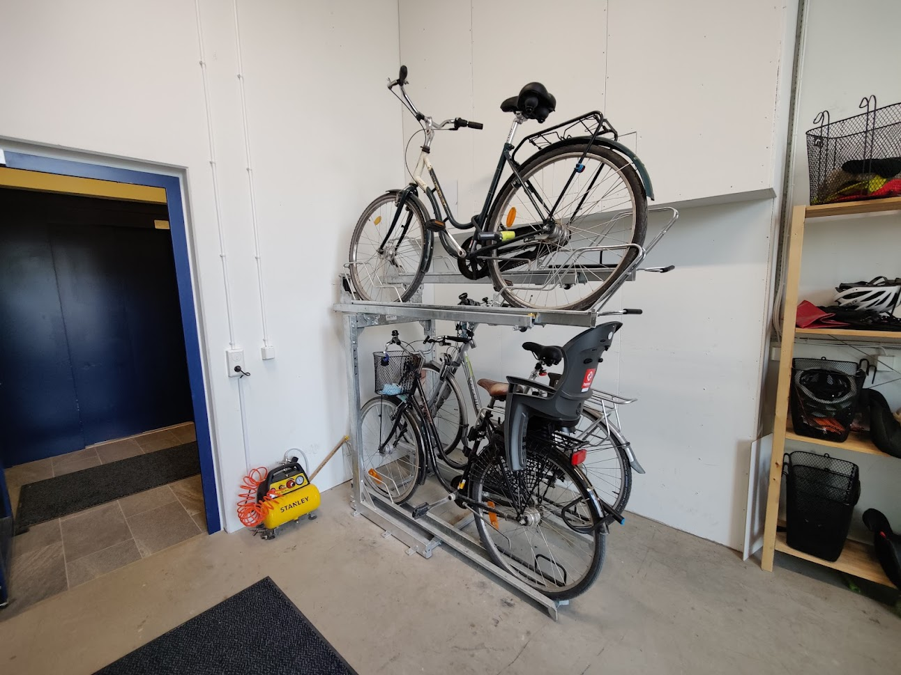
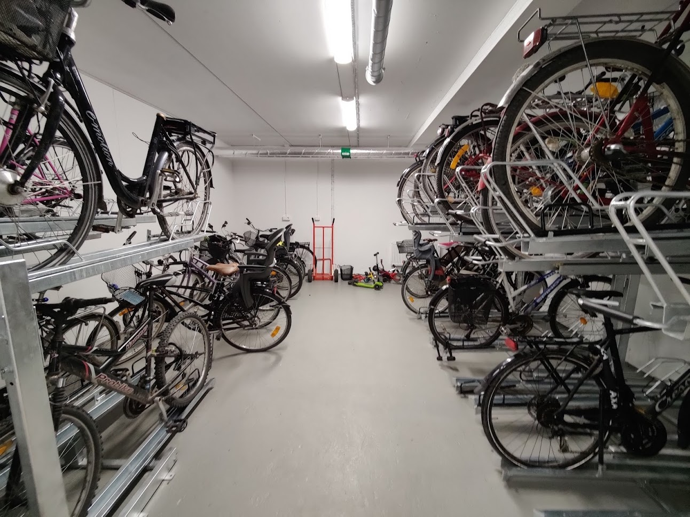

We have two bike rooms: one in the basement and one at street level. The one at street level is smaller and has a compressor for tyres as well as a shelf with bike baskets and helmets to borrow.

## The house's own bikes

The electric cargo bike and the e-bike are kept in the bike room at street level and are booked at
[booking.rudbeckia.nu](https://booking.rudbeckia.nu) – see [Book](../../boka/).
The keys and batteries hang on the shelf in the cleaning room next to the lift; put
the key back and the battery on charge when you are done.

## Where do I put my bike?

We have a few informal rules. One is that if you can manage to lift your bike to the upper level, you do — that makes room downstairs.

### At street level

If you use your bike every day, you can keep it at street level.

### In the basement

If you use your bike less often than every day, or if your bike needs charging.

