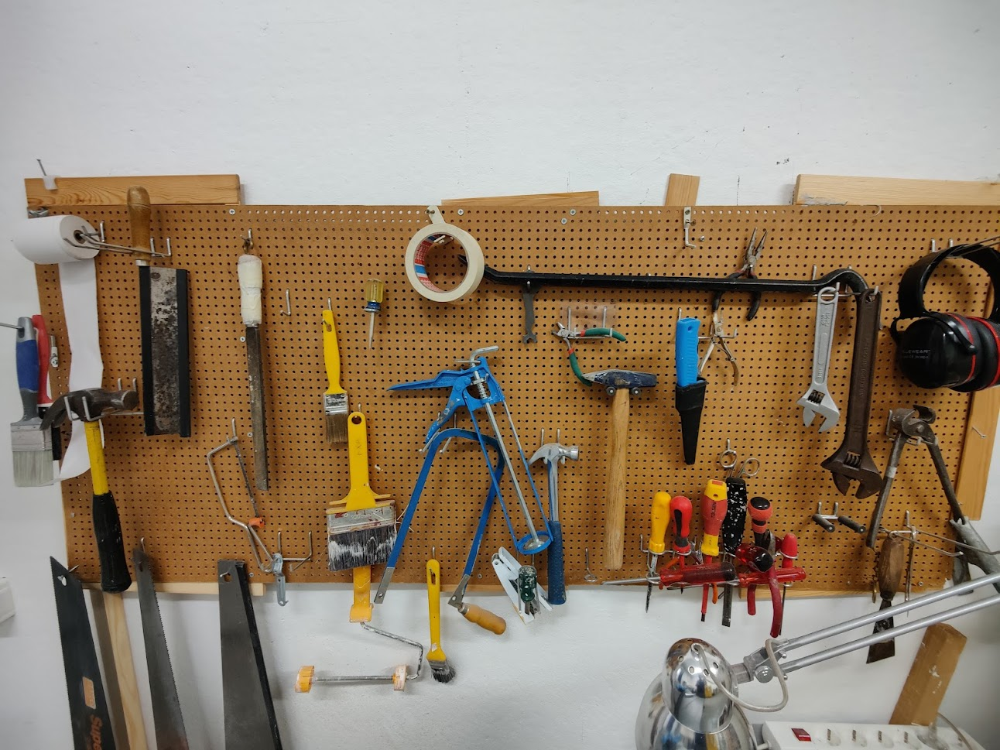
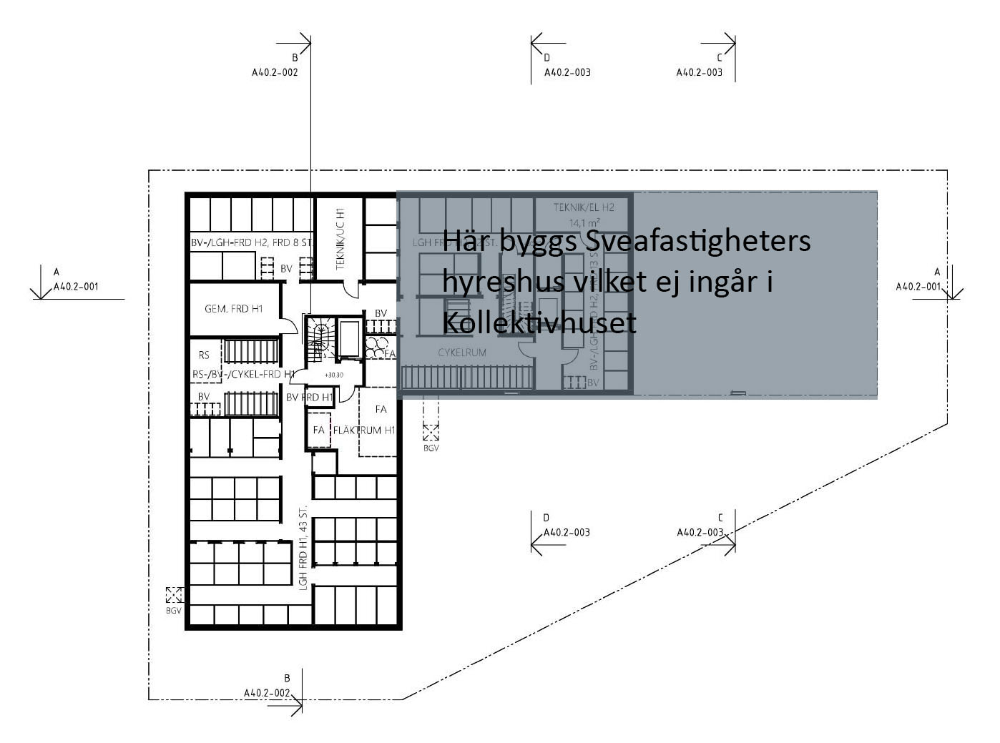
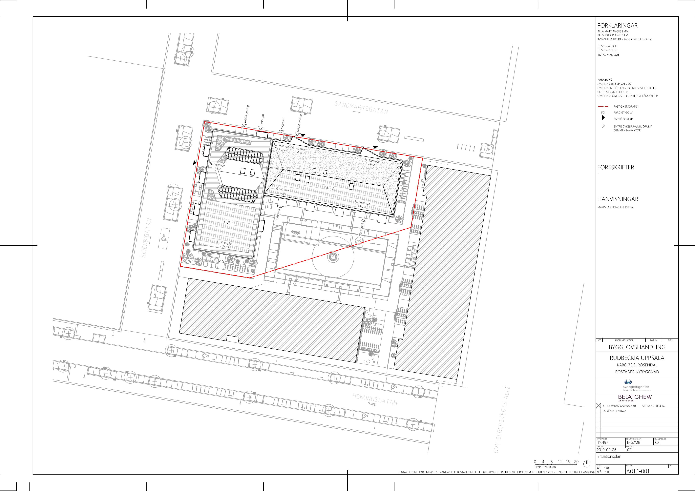
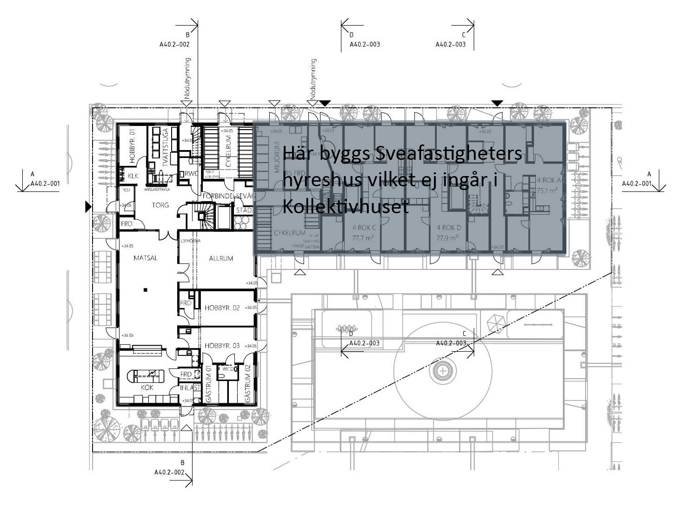
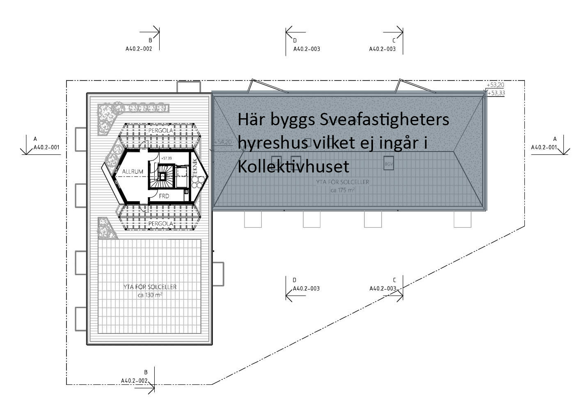

Kollektivhuset Rudbeckia har 42 lägenheter, flera gemensamma ytor på entréplanet, ett källarplan och en generöst tilltagen takterass. Nedan finner du mer information om dessa ytor.

## Bofaktablad

Bofaktabladet innehåller detaljerade ritningar över samtliga lägenheter i huset i skala **1:100**. För varje lägenhetstyp finns även de lägenhetsnummer som motsvarar respektive storlek. Bofaktabladet finns som en pdf med många sidor – en för varje lägenhetstyp.

## Entréplan och gemensamma ytor

På entréplanet finns den absoluta majoriteten av de ytor vi delar på som kollektiv: matsalen och storköket, studierummet, vardagsrummet, tvättstugan, de olika hobbyrummen och två av våra gästrum.

## Källarplan

På källarplanet finns en snickarverkstad med verktyg och bänkyta för att förverkliga dina projekt. Här finns också ett större cykelrum och förråd som hör till de enskilda lägenheterna.

## Takvåningen

På takvåningen finns ett rum för umgänge, meditation, målning och odling. På takterassen finns odlingslådor och gott om yta för umgänge, grillning och sena kvällar med samtal.

## Situationsplan

Intill Rudbeckia finns en trevligt planerad innergård med lekytor som delas med huset Balder. Framför huset i västlig riktning finns parken Carlshage.
