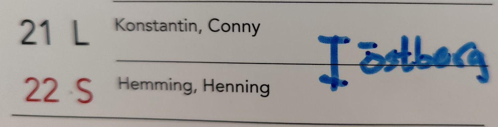

Gästrummen bokas på en fysisk kalender vid torget. Det finns tre rum: två större på markplan intill lekrummet och ett litet övernattningsrum på plan 6 intill hissen.

## Hur bokar jag ett gästrum?

Bor du i huset bokar du på plats via kalendern på whiteboarden vid torget. Markera med ditt namn och lägenhetsnummer.

## Vad förväntas av min gäst?

Din gäst (eller du som bokar) städar gästrummet och badrummet och återställer minst till samma nivå som tidigare. En liten städvagn finns i badrummet.
