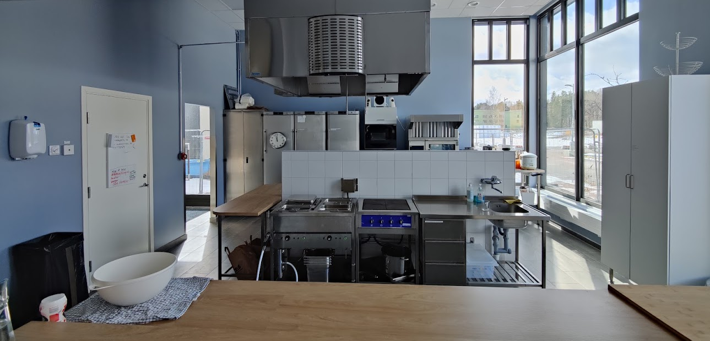

I Rudbeckia är vi väldigt stolta över vårt fina kök!

Det är ett fullt utrustat storkök med spishäll, två kokare, varmluftsugn, stekhäll och industridiskmaskin. Här lagar [Matlagen](../../kollektivet/matlagen/) mat varje **tisdag** och **torsdag**. Övrig tid går köket utmärkt att använda för privat bruk – så länge man praktiserar scout-regeln och städar det till samma nivå som man hittade det eller bättre.

## Hur funkar allting i köket?

I takt med att man deltar i matlagen finns alla möjligheter att lära sig hur köket fungerar. Det bästa sättet att lära sig är att delta i matlagningen.

## Kan jag låna någonting från köket?

Detta har ännu inte diskuterats vid ett husmöte, men om man lånar utrustning eller råvaror förväntas man lämna tillbaka eller ersätta det innan det behövs i köket nästa gång.
