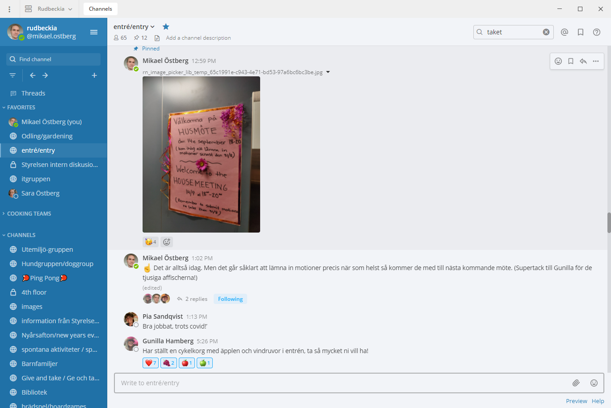

Även när vi är utspridda i huset, Uppsala eller världen är kollektivet nära — vi använder [Mattermost](https://mattermost.com/) för att hålla kontakt med grannar, småprata, arrangera spontana aktiviteter och organisera matlagen.

Styrelsen och föreningen använder också Mattermost för att diskutera sakfrågor. När du flyttar in får du en inbjudningslänk — delta gärna även digitalt för att inte missa aktiviteter och händelser.

Se [Kanaler i Mattermost](/kollektivet/mattermost-kanaler/) för en översikt över de öppna kanaler som används just nu, med direktlänkar.
