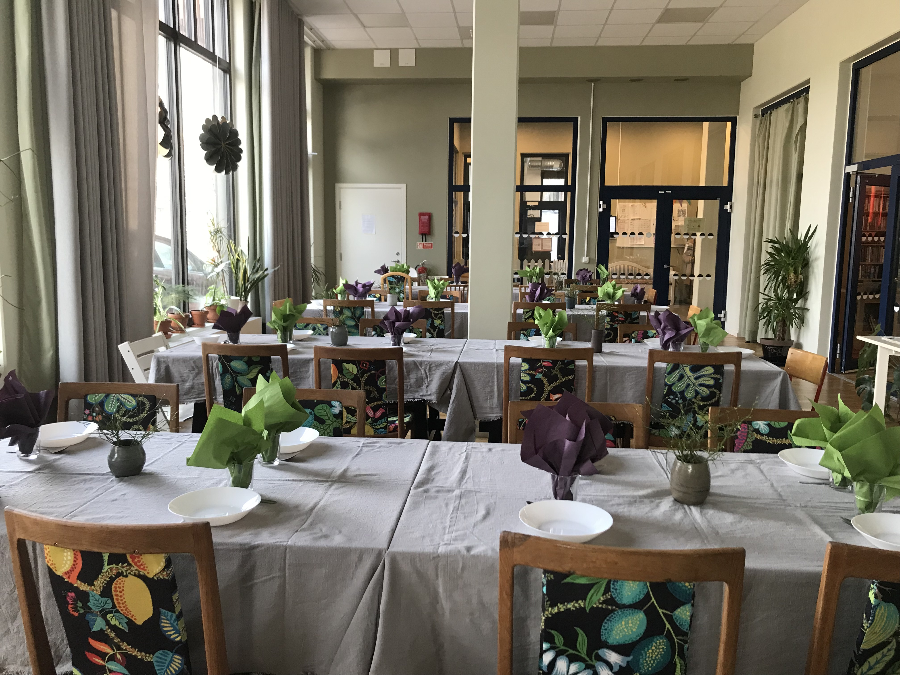
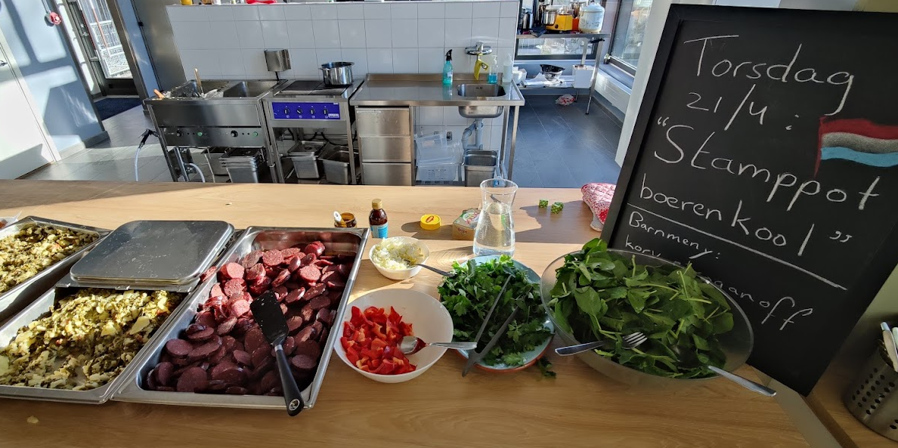

Bor du i huset är du också med i ett matlag. Varje matlag har en eller flera teamledare; i dagsläget finns **fem** matlag.

Vi lagar mat varje **tisdag** och **torsdag** och middagen börjar oftast 17:30.

Du förväntas delta i ungefär två pass per matlagsvecka. Kan du inte alls, försök hitta en ersättare från ett annat matlag.

## Matlagets ansvar

Matlaget sätter sin egen budget och pris per portion och ansvarar för alla delar av matlagningen:

- Komma fram till vilka recept som ska lagas
- Bestämma vem som ska genomföra vilket moment
- Inhandling
- Tillagning
- Servering
- Städning av köket
- Städning av matsalen

## Kostnad

Måltiden kostar veckans råvaror minus **800 kr** i föreningssubvention, utslaget på de vuxna som äter.

## Veckoplanering

Exempel på en veckoplanering för ett matlag:

| Vem | Måndag | Tisdag | Onsdag | Torsdag |
|-----|--------|--------|--------|---------|
| Mikael | Förbereder 20–21 | | | |
