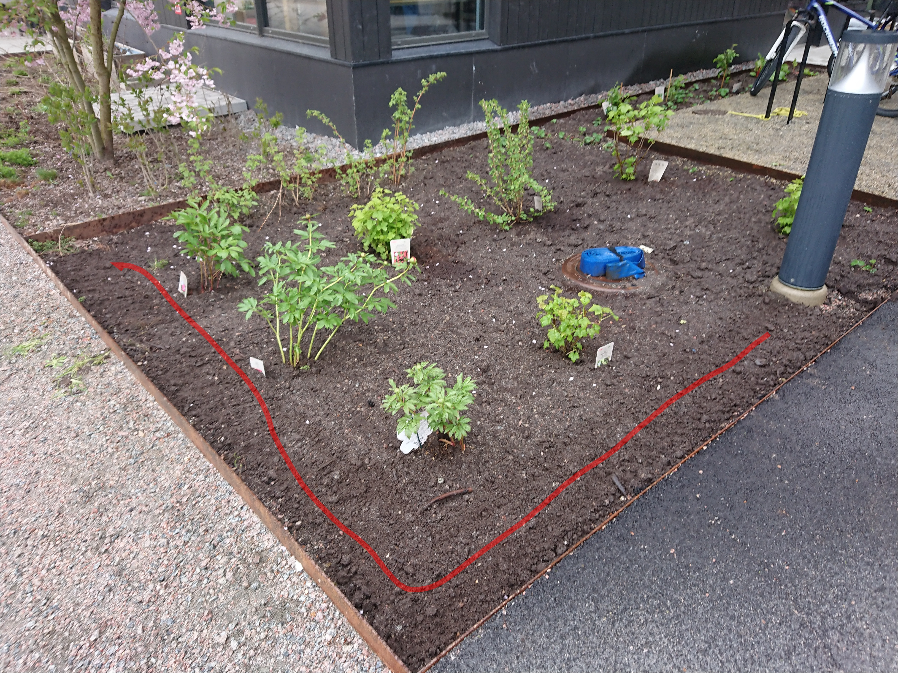
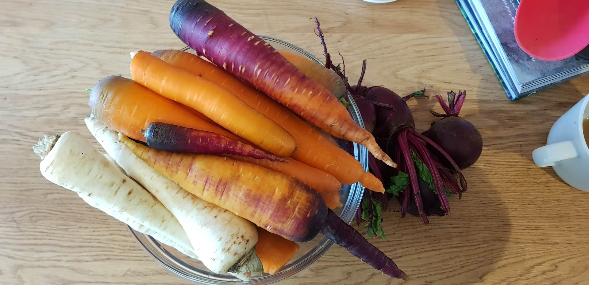

På den enorma [takterassen](../../huset/takterassen/) odlar vi idag mestadels sallad, chili, tomater och kryddor, men har ännu inte bestämt alla detaljer omkring vad som ska odlas där. Vi har även en liten bärodling på bottenplan i anslutning till köksdelen där vi odlar vinbär, krusbär, hallon, björnbär, jordgubbar och lite blommor.

Om du är intresserad av odling är du mer än välkommen att delta.

Anslut dig gärna till Mattermost-kanalen [#odling](https://chat.rudbeckia.nu/rudbeckia/channels/odling) för att få hänga på nästa gång vi far till kolonilotten!
