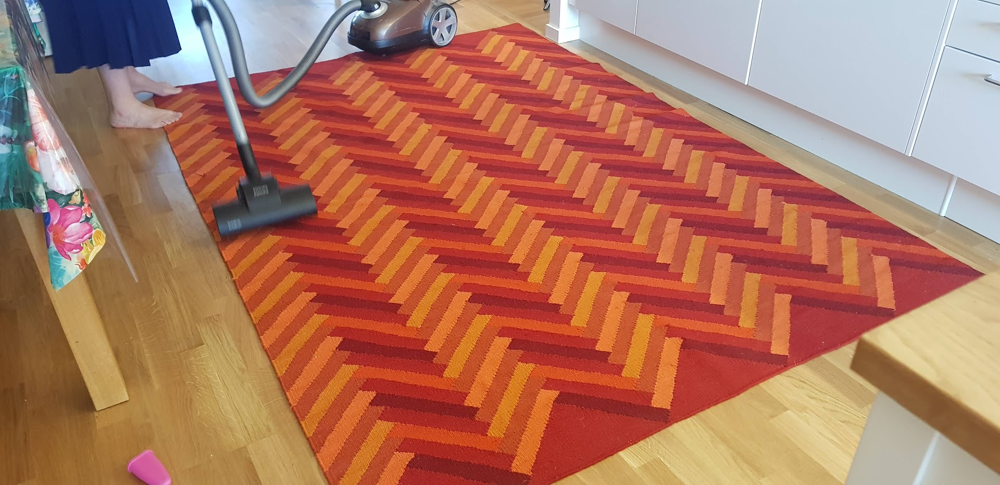

Föreningen har ett städavtal med SVEA Fastigheter (vår hyresvärd) som förbinder oss att städa de gemensamma inomhusytor vi använder, mot månadsersättning.

Städningen är föreningens huvudinkomst — det är viktigt att vi sköter uppdraget väl.

:::note
Vi har sagt upp avtalet med Hemvist om städning av mer offentliga ytor (trapphus, entréer, cykelrum och källare) och städar nu bara våra gemensamma inre ytor. De är fördelade på sju städgrupper: kontor, takrum, barnrum, snicken, gymmet, vardagsrum och matsal. Alla husmedlemmar ingår i en grupp.
:::

## Månadsvis städschema

Se [månadsvis städschema](../stadschema/).
