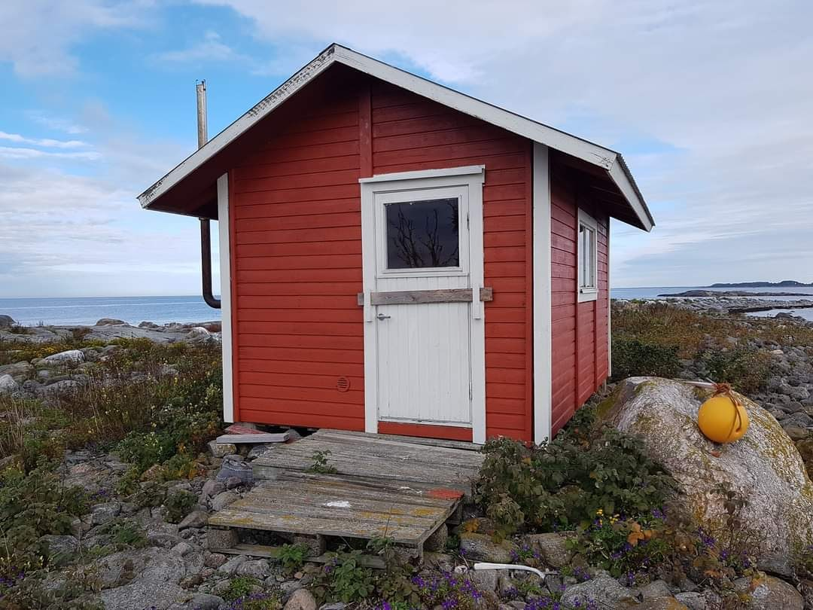

Här är en checklista för att vägleda dig som nyinflyttad.

## Inför inflytt

- Läs igenom materialet som finns på denna webbplats – särskilt de viktigaste [reglerna](./huset/regler/) vi har i huset.
- Maila [kontakt@rudbeckia.nu](mailto:kontakt@rudbeckia.nu) och be om tillgång till Mattermost och wikin om du inte fått det redan.
- Skapa ett konto i Mattermost och wikin.
- Introducera dig själv i **entré**-kanalen.
- Fråga i kanalen om någon vill ställa upp som mentor.
- **Om du har bil:** Läs igenom informationen om de olika parkeringar som finns i närheten av huset.
- Undersök husets cykelpool och se hur du [bokar elcykel och ellastcykel](./boka/).

## Under inflytt

**En pirra** och **två flyttskivor** i olika storlekar finns att hämta i cykelrummet på **plan -1** för att underlätta inflyttningen.

:::caution[Varning för hissen]
Var särskilt försiktig när du använder hissen och blockera inte själva dörren när den försöker stänga.
:::
