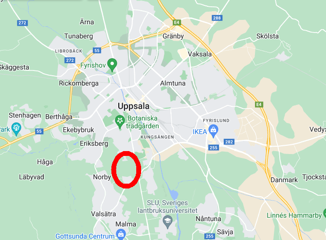
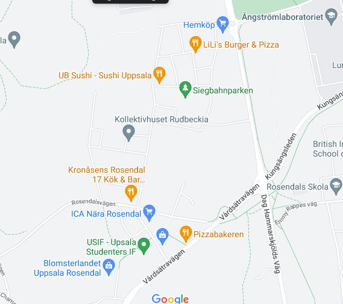

Rosendal är en ny stadsdel i södra Uppsala mellan Ulleråker, Kåbo och Norby, och kollektivhuset ligger i dess tilltänkta centrum. Stadsdelen är under uppbyggnad och byggstöket är ofta märkbart, men vi i Rudbeckia är ganska besparade tack vare att vi gränsar till parken Carlshage och delar innergård med projektet [Kompositören](https://bygg.uppsala.se/globalassets/uppsala-vaxer/dokument/stadsplanering--utveckling/planerade-omraden/markanvisningar/rosendal-etapp-3/kvarter-h2-balder-projektutveckling-ab).

## Infrastruktur idag

I Rosendal finns redan gott om service:

- Två livsmedelsbutiker
  - Ett Hemköp i norra delen
  - Ett ICA Nära i södra delen
- [Rosendal Frukt & Grönt](https://www.facebook.com/Rosendalfrukt/)
- [Rosendal Ost & Chark](https://www.facebook.com/Rosendal-OstChark-109794634880292/)
- 3 pizzerior
- [Blomsterlandet](https://www.blomsterlandet.se/hitta-din-butik/uppsala-rosendal/)
- [UB Sushi](https://ubsushi.se/)
- [Elma All Day Dining](https://www.thefork.se/restaurang/elma-all-day-dining-r575323/meny)
- [Leijon stenugnsbageri och konditori](https://leijonbageri.se/)
- Två vårdcentraler & BVC
  - Familjeläkarna
  - Praktikertjänst
